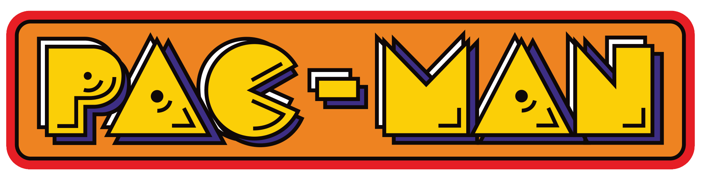

# Pac-Man for the LandTiger LPC1768 board

<html>
    

        
    

</html>

This is an implementation of the Pac-Man game for the **LandTiger**, an ARM-based LPC1768 board, developed from stratch as a project for the course of Computer Architectures at Politecnico di Torino (MSc in Computer Engineering).

## Custom peripherals library

The game is written in C, and has been developed using my custom library for the board peripherals, which is available [here](github.com/fabcolonna/polito-cas-landtiger-lib), using the sample Keil project available in the `sample-project` branch of the library repository. Check out the Doxygen documentation of this library by clicking on the badge above.

The sample project has been modified to expect the .lib file in a specific directory, that's why I've included two scripts - `GetLatestPeripheralsLib.ps1` or `get-latest-peripherals-lib.sh` - that are responsible for downloading the latest release of the library from the Releases page of the library repo, and placing it in the correct directory.

Whenever a new version of the library is released, you can update the one in your project by running those scripts again and recompiling.

More info on this can be found in the [README](https://github.com/fabcolonna/polito-cas-landtiger-lib/blob/main/README.md) of the library repo.

## Project Specifications

The PDFs containing the project specs can be found in the `Docs/` folder. Further details will be gradually added to this file during development, alongside instructions for building and running the game itself.

## License

This project is licensed under the MIT License. For more information, please refer to the LICENSE file.
